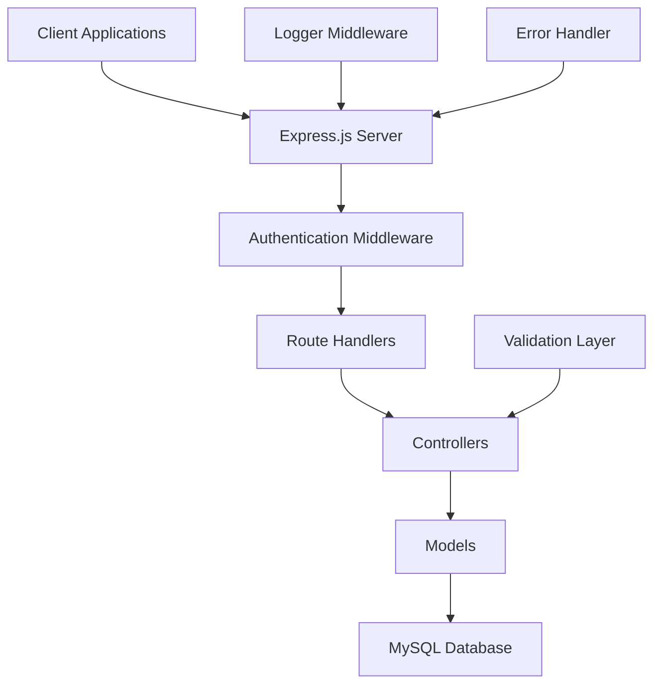
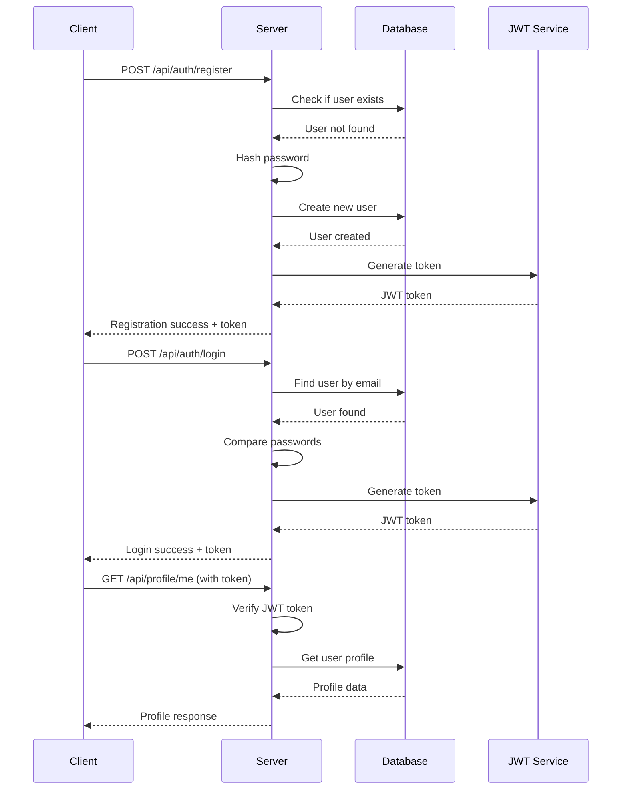
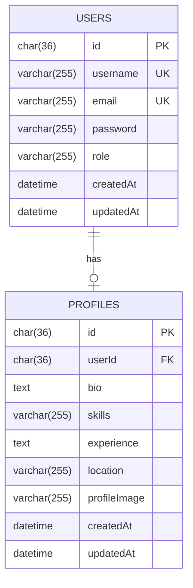

# 🚀 ByAndSell - Professional Networking & Marketplace API

A comprehensive Node.js REST API for a professional networking and marketplace platform that connects employers, employees, buyers, sellers, and connectors in a unified ecosystem.

## 📋 Table of Contents

- [🎯 Project Overview](#-project-overview)
- [✨ Features](#-features)
- [🏗️ Architecture](#️-architecture)
- [🔧 Installation](#-installation)
- [🚀 Quick Start](#-quick-start)
- [📚 API Documentation](#-api-documentation)
- [🎨 UI/UX Design Guidelines](#-uiux-design-guidelines)
- [🔐 Authentication Flow](#-authentication-flow)
- [📱 Frontend Integration Guide](#-frontend-integration-guide)
- [🛠️ Development](#-development)
- [📊 Database Schema](#-database-schema)
- [🔒 Security](#-security)
- [🚀 Deployment](#-deployment)

## 🎯 Project Overview

ByAndSell is a modern, scalable API that serves as the backbone for a multi-role professional platform. It enables seamless interactions between different user types while maintaining security, performance, and user experience at its core.

### 🎭 User Roles
- **👔 Employer**: Post jobs, find talent, manage hiring processes
- **👨‍💼 Employee**: Create profiles, apply for jobs, showcase skills
- **🛒 Buyer**: Browse products/services, make purchases
- **🏪 Seller**: List products/services, manage inventory
- **🤝 Connector**: Facilitate connections between parties

## ✨ Features

### 🔐 Authentication & Authorization
- ✅ JWT-based authentication
- ✅ Role-based access control (RBAC)
- ✅ Secure password hashing with bcrypt
- ✅ Token expiration and refresh mechanisms

### 👤 User Management
- ✅ User registration with role selection
- ✅ Secure login/logout
- ✅ Profile management (CRUD operations)
- ✅ **File Upload System** (Profile images with Multer)
- ✅ User data validation and sanitization

### 🛡️ Security Features
- ✅ Input validation and sanitization
- ✅ SQL injection prevention
- ✅ XSS protection
- ✅ Rate limiting ready
- ✅ CORS configuration

### 📊 Monitoring & Logging
- ✅ Request/response logging
- ✅ Performance monitoring
- ✅ Error tracking and handling

## 🏗️ Architecture



### 📁 Project Structure

```
test-project/
├── 📁 config/
│   └── database.js          # Database configuration
├── 📁 controller/
│   ├── auth.controller.js   # Authentication logic
│   └── profileController.js # Profile management
├── 📁 midlewares/          # Note: Typo in folder name
│   ├── auth.middleware.js   # JWT verification
│   └── upload.middleware.js # File upload handling
├── 📁 models/
│   ├── user.model.js       # User data model
│   └── Profile.js          # Profile data model
├── 📁 routes/
│   ├── auth.routes.js      # Authentication routes
│   └── profileRoutes.js    # Profile routes
├── 📁 utils/
│   └── logger.js           # Request logging utility
├── 📁 service/             # Business logic layer (empty)
├── 📁 validator/           # Input validation (empty)
├── 📁 uploads/             # File upload storage
│   └── profile-images/     # Profile image uploads
├── server.js               # Application entry point
├── package.json            # Dependencies and scripts
└── .env                    # Environment variables
```

## 🔧 Installation

### Prerequisites
- **Node.js** (v16+ recommended)
- **MySQL** (v8.0+)
- **npm** or **yarn**

### 1. Clone the Repository
```bash
git clone <repository-url>
cd test-project
```

### 2. Install Dependencies
```bash
npm install
```

**Current Dependencies:**
```json
{
  "dependencies": {
    "bcryptjs": "^3.0.2",
    "dotenv": "^17.2.3", 
    "express": "^5.1.0",
    "jsonwebtoken": "^9.0.2",
    "multer": "^2.0.2",
    "mysql2": "^3.15.2",
    "sequelize": "^6.37.7",
    "uuid": "^13.0.0"
  }
}
```

### 3. Environment Setup
Create a `.env` file in the root directory:

```env
# Database Configuration
DB_NAME=byandsell_db
DB_USER=your_username
DB_PASS=your_password
DB_HOST=localhost
DB_DIALECT=mysql

# JWT Configuration
JWT_SECRET=your_super_secret_jwt_key_here

# Server Configuration
PORT=5000
NODE_ENV=development
```

### 4. Database Setup
```bash
# Create database
mysql -u root -p
CREATE DATABASE byandsell_db;
```

## 🚀 Quick Start

### Development Mode
```bash
npm run dev
```

### Production Mode
```bash
npm start
```

### Test the API
```bash
curl http://localhost:5000/test
# Response: "Hello, World!"
```

## 📚 API Documentation

### Base URL
```
http://localhost:5000/api
```

### 🔐 Authentication Endpoints

#### Register User
```http
POST /api/auth/register
Content-Type: application/json

{
  "username": "johndoe",
  "email": "john@example.com",
  "password": "securePassword123",
  "role": "employee"
}
```

**Response:**
```json
{
  "message": "User registered successfully",
  "token": "eyJhbGciOiJIUzI1NiIsInR5cCI6IkpXVCJ9...",
  "user": {
    "id": "uuid-here",
    "username": "johndoe",
    "email": "john@example.com",
    "role": "employee"
  }
}
```

#### Login User
```http
POST /api/auth/login
Content-Type: application/json

{
  "email": "john@example.com",
  "password": "securePassword123"
}
```

**Response:**
```json
{
  "message": "Login successful",
  "token": "eyJhbGciOiJIUzI1NiIsInR5cCI6IkpXVCJ9...",
  "user": {
    "id": "uuid-here",
    "username": "johndoe",
    "email": "john@example.com",
    "role": "employee"
  }
}
```

### 👤 Profile Endpoints (Protected)

#### Create/Update Profile (with File Upload)
```http
POST /api/profile
Authorization: Bearer <your-jwt-token>
Content-Type: multipart/form-data

Form Data:
- profileImage: [FILE] (Optional - JPG, PNG, GIF, etc. Max 5MB)
- bio: "Experienced software developer"
- skills: "JavaScript, Node.js, React"
- experience: "5 years"
- location: "New York, NY"
```

**Response:**
```json
{
  "message": "Profile saved successfully!",
  "profile": {
    "id": "uuid-here",
    "userId": "user-uuid",
    "bio": "Experienced software developer",
    "skills": "JavaScript, Node.js, React",
    "experience": "5 years",
    "location": "New York, NY",
    "profileImage": "/uploads/profile-images/user-uuid_1729512345_abc123.jpg",
    "createdAt": "2025-10-21T12:00:00.000Z",
    "updatedAt": "2025-10-21T12:00:00.000Z"
  }
}
```

#### Upload Profile Image Only
```http
POST /api/profile/upload-image
Authorization: Bearer <your-jwt-token>
Content-Type: multipart/form-data

Form Data:
- profileImage: [FILE] (Required - JPG, PNG, GIF, etc. Max 5MB)
```

**Response:**
```json
{
  "message": "Profile image uploaded successfully!",
  "profileImage": "/uploads/profile-images/user-uuid_1729512345_abc123.jpg",
  "profile": {
    "id": "uuid-here",
    "userId": "user-uuid",
    "profileImage": "/uploads/profile-images/user-uuid_1729512345_abc123.jpg"
  }
}
```

#### Get My Profile
```http
GET /api/profile/me
Authorization: Bearer <your-jwt-token>
```

**Response:**
```json
{
  "id": "uuid-here",
  "userId": "user-uuid",
  "bio": "Experienced software developer",
  "skills": "JavaScript, Node.js, React",
  "experience": "5 years",
  "location": "New York, NY",
  "profileImage": "/uploads/profile-images/user-uuid_1729512345_abc123.jpg",
  "user": {
    "username": "johndoe",
    "email": "john@example.com",
    "role": "employee"
  }
}
```

### 📸 File Upload System

#### Supported File Types
- **Images**: JPG, JPEG, PNG, GIF, BMP, WEBP, SVG
- **Size Limit**: 5MB per file
- **Storage**: Local filesystem (`uploads/profile-images/`)
- **Naming**: `userId_timestamp_uuid.extension`

#### File Upload Features
- ✅ **Automatic validation** - Only image files accepted
- ✅ **Size limits** - 5MB maximum file size
- ✅ **Unique filenames** - Prevents conflicts
- ✅ **Secure storage** - Files stored outside web root
- ✅ **Error handling** - Comprehensive error messages
- ✅ **Static serving** - Direct URL access to uploaded files

#### Error Responses
```json
// File too large
{
  "message": "File too large. Maximum size is 5MB."
}

// Invalid file type
{
  "message": "Only image files (JPG, PNG, GIF, etc.) are allowed."
}

// No file uploaded
{
  "message": "No image file uploaded. Please select an image."
}

// Wrong field name
{
  "message": "Unexpected field. Use \"profileImage\" as field name."
}
```

## 🎨 UI/UX Design Guidelines

### 🎯 Design Principles

#### 1. **User-Centric Design**
- **Accessibility First**: WCAG 2.1 AA compliance
- **Mobile-First**: Responsive design for all screen sizes
- **Intuitive Navigation**: Clear information architecture

#### 2. **Visual Hierarchy**
- **Typography**: Clean, readable fonts (Recommended: Inter, Roboto)
- **Color Palette**: Professional and accessible
- **Spacing**: Consistent 8px grid system

#### 3. **Performance**
- **Fast Loading**: < 3 seconds initial load
- **Smooth Interactions**: 60fps animations
- **Offline Support**: Progressive Web App capabilities

### 🎨 Recommended UI Framework Stack

```javascript
// Frontend Technology Stack
{
  "framework": "React 18+ / Next.js 13+",
  "styling": "Tailwind CSS",
  "components": "shadcn/ui",
  "icons": "Lucide React",
  "animations": "Framer Motion",
  "forms": "React Hook Form + Zod",
  "state": "Zustand / Redux Toolkit"
}
```

### 🎭 Role-Based UI Components

#### 👔 Employer Dashboard
```jsx
// Employer-specific components
<EmployerDashboard>
  <JobPostingForm />
  <CandidateList />
  <InterviewScheduler />
  <HiringAnalytics />
</EmployerDashboard>
```

#### 👨‍💼 Employee Profile
```jsx
// Employee-specific components
<EmployeeProfile>
  <SkillsShowcase />
  <ExperienceTimeline />
  <PortfolioGallery />
  <JobApplications />
</EmployeeProfile>
```

#### 🛒 Marketplace Interface
```jsx
// Buyer/Seller components
<MarketplaceInterface>
  <ProductCatalog />
  <ShoppingCart />
  <OrderTracking />
  <ReviewSystem />
</MarketplaceInterface>
```

### 📱 Responsive Breakpoints

```css
/* Mobile First Approach */
.container {
  /* Mobile: 320px - 768px */
  padding: 1rem;
}

@media (min-width: 768px) {
  /* Tablet: 768px - 1024px */
  .container {
    padding: 2rem;
    max-width: 768px;
  }
}

@media (min-width: 1024px) {
  /* Desktop: 1024px+ */
  .container {
    padding: 3rem;
    max-width: 1200px;
  }
}
```

### 🎨 Color System

```css
:root {
  /* Primary Colors */
  --primary-50: #eff6ff;
  --primary-500: #3b82f6;
  --primary-900: #1e3a8a;
  
  /* Role-based Colors */
  --employer: #059669;    /* Green */
  --employee: #3b82f6;    /* Blue */
  --buyer: #dc2626;       /* Red */
  --seller: #d97706;      /* Orange */
  --connector: #7c3aed;   /* Purple */
  
  /* Semantic Colors */
  --success: #10b981;
  --warning: #f59e0b;
  --error: #ef4444;
  --info: #06b6d4;
}
```

## 🔐 Authentication Flow



## 📱 Frontend Integration Guide

### 🔧 API Client Setup

```javascript
// api/client.js
import axios from 'axios';

const apiClient = axios.create({
  baseURL: 'http://localhost:5000/api',
  timeout: 10000,
});

// Request interceptor for auth token
apiClient.interceptors.request.use((config) => {
  const token = localStorage.getItem('authToken');
  if (token) {
    config.headers.Authorization = `Bearer ${token}`;
  }
  return config;
});

// Response interceptor for error handling
apiClient.interceptors.response.use(
  (response) => response,
  (error) => {
    if (error.response?.status === 401) {
      localStorage.removeItem('authToken');
      window.location.href = '/login';
    }
    return Promise.reject(error);
  }
);

export default apiClient;
```

### 🎣 React Hooks for API Integration

```javascript
// hooks/useAuth.js
import { useState, useEffect } from 'react';
import apiClient from '../api/client';

export const useAuth = () => {
  const [user, setUser] = useState(null);
  const [loading, setLoading] = useState(true);

  const login = async (email, password) => {
    try {
      const response = await apiClient.post('/auth/login', {
        email,
        password
      });
      
      const { token, user } = response.data;
      localStorage.setItem('authToken', token);
      setUser(user);
      return { success: true, user };
    } catch (error) {
      return { 
        success: false, 
        error: error.response?.data?.message || 'Login failed' 
      };
    }
  };

  const register = async (userData) => {
    try {
      const response = await apiClient.post('/auth/register', userData);
      const { token, user } = response.data;
      localStorage.setItem('authToken', token);
      setUser(user);
      return { success: true, user };
    } catch (error) {
      return { 
        success: false, 
        error: error.response?.data?.message || 'Registration failed' 
      };
    }
  };

  const logout = () => {
    localStorage.removeItem('authToken');
    setUser(null);
  };

  useEffect(() => {
    const token = localStorage.getItem('authToken');
    if (token) {
      // Verify token and get user data
      apiClient.get('/profile/me')
        .then(response => setUser(response.data.User))
        .catch(() => localStorage.removeItem('authToken'))
        .finally(() => setLoading(false));
    } else {
      setLoading(false);
    }
  }, []);

  return { user, login, register, logout, loading };
};
```

### 🎨 UI Components Examples

```jsx
// components/LoginForm.jsx
import { useState } from 'react';
import { useAuth } from '../hooks/useAuth';

const LoginForm = () => {
  const [email, setEmail] = useState('');
  const [password, setPassword] = useState('');
  const [error, setError] = useState('');
  const { login } = useAuth();

  const handleSubmit = async (e) => {
    e.preventDefault();
    const result = await login(email, password);
    
    if (!result.success) {
      setError(result.error);
    }
  };

  return (
    <form onSubmit={handleSubmit} className="space-y-4">
      <div>
        <label className="block text-sm font-medium text-gray-700">
          Email
        </label>
        <input
          type="email"
          value={email}
          onChange={(e) => setEmail(e.target.value)}
          className="mt-1 block w-full rounded-md border-gray-300 shadow-sm focus:border-primary-500 focus:ring-primary-500"
          required
        />
      </div>
      
      <div>
        <label className="block text-sm font-medium text-gray-700">
          Password
        </label>
        <input
          type="password"
          value={password}
          onChange={(e) => setPassword(e.target.value)}
          className="mt-1 block w-full rounded-md border-gray-300 shadow-sm focus:border-primary-500 focus:ring-primary-500"
          required
        />
      </div>

      {error && (
        <div className="text-red-600 text-sm">{error}</div>
      )}

      <button
        type="submit"
        className="w-full flex justify-center py-2 px-4 border border-transparent rounded-md shadow-sm text-sm font-medium text-white bg-primary-600 hover:bg-primary-700 focus:outline-none focus:ring-2 focus:ring-offset-2 focus:ring-primary-500"
      >
        Sign In
      </button>
    </form>
  );
};
```

## 🛠️ Development

### 📝 Code Style Guidelines

```javascript
// ESLint + Prettier configuration
{
  "extends": ["eslint:recommended", "prettier"],
  "rules": {
    "no-console": "warn",
    "no-unused-vars": "error",
    "prefer-const": "error"
  }
}
```

### 🧪 Testing Strategy

```javascript
// Example test structure
describe('Authentication API', () => {
  test('should register new user', async () => {
    const userData = {
      username: 'testuser',
      email: 'test@example.com',
      password: 'password123',
      role: 'employee'
    };

    const response = await request(app)
      .post('/api/auth/register')
      .send(userData)
      .expect(201);

    expect(response.body.message).toBe('User registered successfully');
    expect(response.body.token).toBeDefined();
  });
});
```

### 🔄 Git Workflow

```bash
# Feature development
git checkout -b feature/user-profile-enhancement
git add .
git commit -m "feat: add profile image upload functionality"
git push origin feature/user-profile-enhancement

# Create pull request for review
```

## 📊 Database Schema

### 👤 Users Table
```sql
CREATE TABLE users (
  id CHAR(36) PRIMARY KEY,
  username VARCHAR(255) UNIQUE NOT NULL,
  email VARCHAR(255) UNIQUE NOT NULL,
  password VARCHAR(255) NOT NULL,
  role VARCHAR(255) NOT NULL DEFAULT 'user',
  createdAt DATETIME NOT NULL,
  updatedAt DATETIME NOT NULL
);
```

### 📋 Profiles Table
```sql
CREATE TABLE profiles (
  id CHAR(36) PRIMARY KEY,
  userId CHAR(36) UNIQUE NOT NULL,
  bio TEXT,
  skills VARCHAR(255),
  experience TEXT,
  location VARCHAR(255),
  profileImage VARCHAR(255) DEFAULT 'default_avatar_url.png',
  createdAt DATETIME NOT NULL,
  updatedAt DATETIME NOT NULL,
  FOREIGN KEY (userId) REFERENCES users(id) ON DELETE CASCADE
);
```

### 🔗 Database Relationships


## 🔒 Security

### 🛡️ Security Measures Implemented

- ✅ **Password Hashing**: bcrypt with 10 salt rounds
- ✅ **JWT Authentication**: Secure token-based auth
- ✅ **Input Validation**: Sequelize built-in validation
- ✅ **SQL Injection Prevention**: Parameterized queries
- ✅ **Environment Variables**: Sensitive data protection

### 🚨 Security Recommendations

```javascript
// Additional security middleware (recommended)
const helmet = require('helmet');
const rateLimit = require('express-rate-limit');
const cors = require('cors');

app.use(helmet());
app.use(cors({
  origin: process.env.FRONTEND_URL,
  credentials: true
}));

const limiter = rateLimit({
  windowMs: 15 * 60 * 1000, // 15 minutes
  max: 100 // limit each IP to 100 requests per windowMs
});
app.use('/api/', limiter);
```

## 🚀 Deployment

### 🐳 Docker Configuration

```dockerfile
# Dockerfile
FROM node:18-alpine

WORKDIR /app

COPY package*.json ./
RUN npm ci --only=production

COPY . .

EXPOSE 5000

CMD ["npm", "start"]
```

### ☁️ Environment-Specific Configurations

```yaml
# docker-compose.yml
version: '3.8'
services:
  api:
    build: .
    ports:
      - "5000:5000"
    environment:
      - NODE_ENV=production
      - DB_HOST=db
    depends_on:
      - db
  
  db:
    image: mysql:8.0
    environment:
      MYSQL_ROOT_PASSWORD: rootpassword
      MYSQL_DATABASE: byandsell_db
    volumes:
      - mysql_data:/var/lib/mysql

volumes:
  mysql_data:
```

### 🌐 Production Deployment Checklist

- [ ] Environment variables configured
- [ ] Database migrations run
- [ ] SSL certificates installed
- [ ] Monitoring and logging setup
- [ ] Backup strategy implemented
- [ ] Load balancer configured
- [ ] CDN setup for static assets

## 📈 Performance Optimization

### ⚡ Backend Optimizations

```javascript
// Database connection pooling
const sequelize = new Sequelize(DB_NAME, DB_USER, DB_PASS, {
  host: DB_HOST,
  dialect: 'mysql',
  pool: {
    max: 10,
    min: 0,
    acquire: 30000,
    idle: 10000
  }
});

// Response compression
const compression = require('compression');
app.use(compression());

// Caching strategy
const redis = require('redis');
const client = redis.createClient();
```

### 🎯 Frontend Performance

```javascript
// Code splitting
const LazyComponent = lazy(() => import('./components/HeavyComponent'));

// Image optimization
<Image
  src="/profile-image.jpg"
  alt="Profile"
  width={200}
  height={200}
  loading="lazy"
  placeholder="blur"
/>

// API response caching
const { data, error } = useSWR('/api/profile/me', fetcher, {
  revalidateOnFocus: false,
  revalidateOnReconnect: false
});
```

## 🤝 Contributing

### 📋 Development Setup

1. Fork the repository
2. Create a feature branch
3. Make your changes
4. Add tests for new functionality
5. Ensure all tests pass
6. Submit a pull request

### 📝 Commit Message Convention

```
feat: add user profile image upload
fix: resolve authentication token expiration issue
docs: update API documentation
style: format code with prettier
refactor: optimize database queries
test: add unit tests for auth controller
```

## 📞 Support & Contact

- **Documentation**: [API Docs](http://localhost:5000/api-docs)
- **Issues**: [GitHub Issues](https://github.com/your-repo/issues)
- **Email**: support@byandsell.com
- **Discord**: [Community Server](https://discord.gg/byandsell)

## 📄 License

This project is licensed under the MIT License - see the [LICENSE](LICENSE) file for details.

---

**Built with ❤️ by the ByAndSell Team**

*Last updated: October 2025*
# bysell_backend

