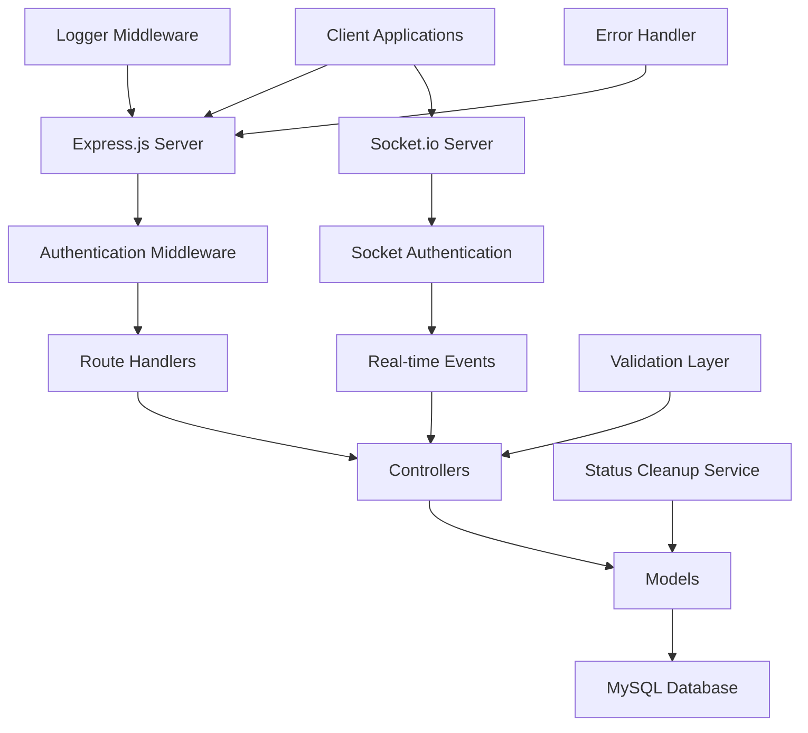
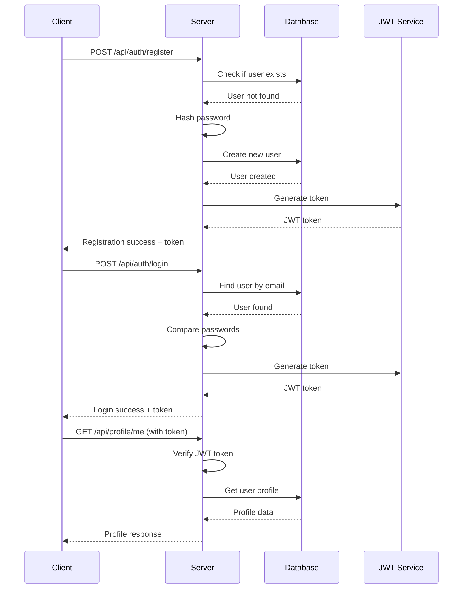
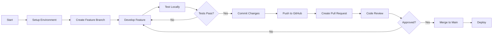
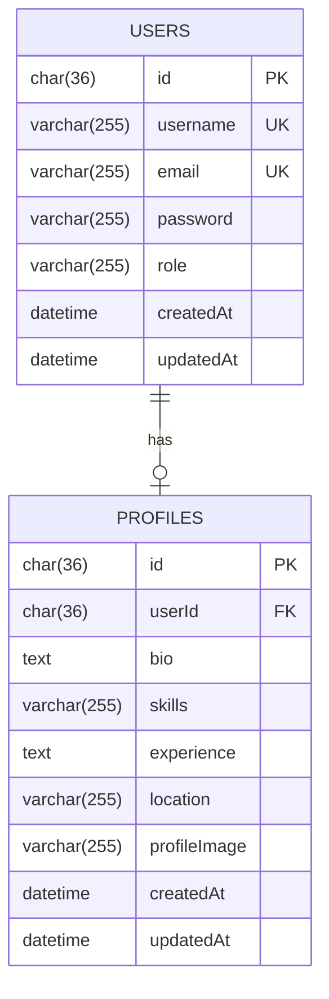

<div align="center">

# 🚀 ETHIO CONNECT - Backend API

### *Multi-Category Networking Platform Backend*

[](https://nodejs.org/)
[](https://expressjs.com/)
[](https://www.mysql.com/)
[](https://socket.io/)
[](LICENSE)

**A comprehensive Node.js REST API with real-time messaging and Socket.io integration for Ethiopia's premier multi-category networking platform.**

[Features](#-features) • [Quick Start](#-quick-start) • [API Docs](#-api-documentation) • [Workflow](#-development-workflow) • [Deployment](#-deployment)

</div>

---

## 📋 Table of Contents

- [🎯 Project Overview](#-project-overview)
- [✨ Features](#-features)
- [🏗️ Architecture](#️-architecture)
- [🔧 Installation](#-installation)
- [🚀 Quick Start](#-quick-start)
- [📚 API Documentation](#-api-documentation)
- [🎨 UI/UX Design Guidelines](#-uiux-design-guidelines)
- [🔐 Authentication Flow](#-authentication-flow)
- [📱 Frontend Integration Guide](#-frontend-integration-guide)
- [🛠️ Development](#-development)
- [📊 Database Schema](#-database-schema)
- [🔒 Security](#-security)
- [🚀 Deployment](#-deployment)

## 🎯 Project Overview

**Ethio Connect** is a production-ready Node.js backend API serving Ethiopia's premier multi-category networking platform. Built with Express, MySQL, and Socket.io for real-time communication.

### **What This Backend Does:**
- 🔐 Secure authentication & authorization system
- 💬 Real-time messaging with WebSocket (Socket.io)
- 👥 Connection management (send/accept/reject)
- 📁 File upload system for profile images
- 🔔 Real-time notifications
- 📊 Posts & search with category filtering
- ⚡ Status tracking (online/offline/away/busy)
- 🗄️ Complete MySQL database with 8 tables

### 🎯 **5 Connection Categories** (SRS Compliant)

| Category | Participants | Purpose |
|----------|--------------|--------|
| **👔 Employment** | Employer ↔️ Employee | Job posting, hiring, professional networking |
| **🏠 Rental** | Renter ↔️ Tenant | Property listings, housing search, rentals |
| **💕 Matchmaking** | Husband ↔️ Wife | Social connections, family matchmaking |
| **🛒 Marketplace** | Buyer ↔️ Seller | Product sales, negotiations, transactions |
| **🔧 Services** | Provider ↔️ Customer | Service offerings, professional hiring |

## ✨ Features

### 🔐 Authentication & Authorization
- ✅ JWT-based authentication
- ✅ Role-based access control (RBAC)
- ✅ Secure password hashing with bcrypt
- ✅ Token expiration and refresh mechanisms

### 👤 User Management
- ✅ User registration with role selection
- ✅ Secure login/logout
- ✅ Profile management (CRUD operations)
- ✅ **File Upload System** (Profile images with Multer)
- ✅ User data validation and sanitization

### 🛡️ Security Features
- ✅ Input validation and sanitization
- ✅ SQL injection prevention
- ✅ XSS protection
- ✅ Rate limiting ready
- ✅ CORS configuration

### 💬 Real-Time Communication
- ✅ **Socket.io WebSocket integration**
- ✅ **Real-time messaging system**
- ✅ **User presence tracking** (online/offline/away/busy)
- ✅ **Typing indicators**
- ✅ **Connection requests with notifications**
- ✅ **Message read receipts**
- ✅ **Conversation management**
- ✅ **Status cleanup service**

### 📊 Monitoring & Logging
- ✅ Request/response logging
- ✅ Performance monitoring
- ✅ Error tracking and handling

## 🏗️ Architecture



### 📁 Project Structure

```
test-project/
├── 📁 config/
│   └── database.js          # Database configuration
├── 📁 controller/
│   ├── auth.controller.js   # Authentication logic
│   ├── profileController.js # Profile management
│   ├── message.controller.js # Messaging system
│   ├── connection.controller.js # Connection requests
│   ├── status.controller.js # User status management
│   ├── notification.controller.js # Notifications
│   ├── post.controller.js   # Posts management
│   ├── search.controller.js # Search functionality
│   └── admin.controller.js  # Admin operations
├── 📁 midlewares/          # Note: Typo in folder name
│   ├── auth.middleware.js   # JWT verification
│   ├── upload.middleware.js # File upload handling
│   └── security.middleware.js # Security headers & rate limiting
├── 📁 models/
│   ├── user.model.js       # User data model
│   ├── Profile.js          # Profile data model
│   ├── message.model.js    # Messages model
│   ├── connection.model.js # Connections model
│   ├── conversation.model.js # Conversations tracking
│   ├── userStatus.model.js # User status & presence
│   ├── notification.model.js # Notifications model
│   ├── post.model.js       # Posts model
│   └── index.js            # Model relationships
├── 📁 routes/
│   ├── auth.routes.js      # Authentication routes
│   ├── profileRoutes.js    # Profile routes
│   ├── message.routes.js   # Messaging API
│   ├── connection.routes.js # Connection management
│   ├── status.routes.js    # Status management
│   ├── notification.routes.js # Notifications API
│   ├── post.routes.js      # Posts API
│   ├── search.routes.js    # Search API
│   └── admin.routes.js     # Admin API
├── 📁 service/
│   └── statusCleanup.service.js # Automatic status cleanup
├── 📁 utils/
│   └── logger.js           # Request logging utility
├── 📁 validator/           # Input validation (empty)
├── 📁 uploads/             # File upload storage
│   └── profile-images/     # Profile image uploads
├── server.js               # Application entry point (with Socket.io)
├── package.json            # Dependencies and scripts
├── .env                    # Environment variables
├── README.md               # Project documentation
├── API_DOCUMENTATION.md    # Complete API reference
├── SOCKET_EVENTS_REFERENCE.md # Socket.io events guide
└── POSTMAN_SETUP.md        # API testing setup
```

## 🔧 Setup

```bash
# 1. Clone
git clone https://github.com/biruk-77/bysell_backend.git
cd bysell_backend

# 2. Install
npm install

# 3. Configure .env (see .env.example)
DB_NAME=ethio_connect_db
DB_USER=root
DB_PASS=your_password
JWT_SECRET=your_secret_key
PORT=5000

# 4. Create Database
mysql -u root -p
CREATE DATABASE ethio_connect_db CHARACTER SET utf8mb4 COLLATE utf8mb4_unicode_ci;

# 5. Run
npm run dev    # Development
npm start      # Production
```

**Dependencies:**
- Express 5.1, Sequelize 6.37, Socket.io 4.7
- MySQL2, JWT, bcrypt, Multer
- See package.json for full list

## 🚀 Quick Start

```bash
npm run dev
```

## 📚 API Documentation

### Base URL
```
http://localhost:5000/api
```

### 🔐 Authentication Endpoints

#### Register User
```http
POST /api/auth/register
Content-Type: application/json

{
  "username": "johndoe",
  "email": "john@example.com",
  "password": "securePassword123",
  "role": "employee"
}
```

**Response:**
```json
{
  "message": "User registered successfully",
  "token": "eyJhbGciOiJIUzI1NiIsInR5cCI6IkpXVCJ9...",
  "user": {
    "id": "uuid-here",
    "username": "johndoe",
    "email": "john@example.com",
    "role": "employee"
  }
}
```

#### Login User
```http
POST /api/auth/login
Content-Type: application/json

{
  "email": "john@example.com",
  "password": "securePassword123"
}
```

**Response:**
```json
{
  "message": "Login successful",
  "token": "eyJhbGciOiJIUzI1NiIsInR5cCI6IkpXVCJ9...",
  "user": {
    "id": "uuid-here",
    "username": "johndoe",
    "email": "john@example.com",
    "role": "employee"
  }
}
```

### 👤 Profile Endpoints (Protected)

#### Create/Update Profile (with File Upload)
```http
POST /api/profile
Authorization: Bearer <your-jwt-token>
Content-Type: multipart/form-data

Form Data:
- profileImage: [FILE] (Optional - JPG, PNG, GIF, etc. Max 5MB)
- bio: "Experienced software developer"
- skills: "JavaScript, Node.js, React"
- experience: "5 years"
- location: "New York, NY"
```

**Response:**
```json
{
  "message": "Profile saved successfully!",
  "profile": {
    "id": "uuid-here",
    "userId": "user-uuid",
    "bio": "Experienced software developer",
    "skills": "JavaScript, Node.js, React",
    "experience": "5 years",
    "location": "New York, NY",
    "profileImage": "/uploads/profile-images/user-uuid_1729512345_abc123.jpg",
    "createdAt": "2025-10-21T12:00:00.000Z",
    "updatedAt": "2025-10-21T12:00:00.000Z"
  }
}
```

#### Upload Profile Image Only
```http
POST /api/profile/upload-image
Authorization: Bearer <your-jwt-token>
Content-Type: multipart/form-data

Form Data:
- profileImage: [FILE] (Required - JPG, PNG, GIF, etc. Max 5MB)
```

**Response:**
```json
{
  "message": "Profile image uploaded successfully!",
  "profileImage": "/uploads/profile-images/user-uuid_1729512345_abc123.jpg",
  "profile": {
    "id": "uuid-here",
    "userId": "user-uuid",
    "profileImage": "/uploads/profile-images/user-uuid_1729512345_abc123.jpg"
  }
}
```

#### Get My Profile
```http
GET /api/profile/me
Authorization: Bearer <your-jwt-token>
```

**Response:**
```json
{
  "id": "uuid-here",
  "userId": "user-uuid",
  "bio": "Experienced software developer",
  "skills": "JavaScript, Node.js, React",
  "experience": "5 years",
  "location": "New York, NY",
  "profileImage": "/uploads/profile-images/user-uuid_1729512345_abc123.jpg",
  "user": {
    "username": "johndoe",
    "email": "john@example.com",
    "role": "employee"
  }
}
```

### 📸 File Upload System

#### Supported File Types
- **Images**: JPG, JPEG, PNG, GIF, BMP, WEBP, SVG
- **Size Limit**: 5MB per file
- **Storage**: Local filesystem (`uploads/profile-images/`)
- **Naming**: `userId_timestamp_uuid.extension`

#### File Upload Features
- ✅ **Automatic validation** - Only image files accepted
- ✅ **Size limits** - 5MB maximum file size
- ✅ **Unique filenames** - Prevents conflicts
- ✅ **Secure storage** - Files stored outside web root
- ✅ **Error handling** - Comprehensive error messages
- ✅ **Static serving** - Direct URL access to uploaded files

#### Error Responses
```json
// File too large
{
  "message": "File too large. Maximum size is 5MB."
}

// Invalid file type
{
  "message": "Only image files (JPG, PNG, GIF, etc.) are allowed."
}

// No file uploaded
{
  "message": "No image file uploaded. Please select an image."
}

// Wrong field name
{
  "message": "Unexpected field. Use \"profileImage\" as field name."
}
```

## 💻 **Backend Code Statistics**

### **What I Built:**

```
📁 Controllers:     ~2,500 lines (9 files)
   ├── auth.controller.js      - Login, register, JWT
   ├── profileController.js    - Profile CRUD operations
   ├── message.controller.js   - Real-time messaging
   ├── connection.controller.js - Connection requests
   ├── status.controller.js    - User presence tracking
   ├── notification.controller.js - Push notifications
   ├── post.controller.js      - Posts management
   ├── search.controller.js    - Search with filters
   └── admin.controller.js     - Admin operations

📁 Models:          ~1,200 lines (8 tables)
   ├── user.model.js          - User authentication
   ├── Profile.js             - User profiles
   ├── message.model.js       - Messages
   ├── connection.model.js    - Connections
   ├── conversation.model.js  - Conversations
   ├── userStatus.model.js    - Online/offline status
   ├── notification.model.js  - Notifications
   └── post.model.js          - Posts & categories

📁 Routes:          ~800 lines (9 routes)
📁 Middleware:      ~400 lines (Auth, Upload, Security)
📁 Socket Handlers: ~600 lines (Real-time events)
📁 Services:        ~200 lines (Status cleanup)

━━━━━━━━━━━━━━━━━━━━━━━━━━━━━━━━━━
   TOTAL:         ~5,700 lines
```

### **Key Implementations:**

```javascript
// ✅ JWT Authentication
const token = jwt.sign({ id: user.id, role: user.role }, JWT_SECRET, { expiresIn: '7d' });

// ✅ Real-time Socket.io Events
io.on('connection', (socket) => {
  socket.on('send_message', handleSendMessage);
  socket.on('typing', handleTyping);
  socket.on('update_status', handleStatusUpdate);
});

// ✅ File Upload with Multer
const upload = multer({
  storage: storage,
  limits: { fileSize: 5 * 1024 * 1024 },
  fileFilter: imageFilter
});

// ✅ Connection System
await Connection.create({
  requesterId: userId,
  receiverId: targetId,
  status: 'pending'
});
```

## 🔐 Authentication Flow



## 📱 **API Integration Guide**

### **How to Connect Frontend:**

```javascript
// Basic API setup
const API_BASE_URL = 'http://localhost:5000/api';

// Include JWT token in requests
headers: {
  'Authorization': `Bearer ${token}`,
  'Content-Type': 'application/json'
}

// Example: Login request
const login = async (email, password) => {
  const response = await fetch(`${API_BASE_URL}/auth/login`, {
    method: 'POST',
    headers: { 'Content-Type': 'application/json' },
    body: JSON.stringify({ email, password })
  });
  return response.json(); // Returns { token, user }
};
```

### **WebSocket Connection:**

```javascript
// Socket.io client connection
import io from 'socket.io-client';

const socket = io('http://localhost:5000', {
  auth: { token: yourJWTToken }
});

// Listen for events
socket.on('new_message', (data) => {
  console.log('New message:', data);
});

// Emit events
socket.emit('send_message', messageData);
```

## 🛠️ Development Workflow

### 📋 **Complete Development Process**



### **Step 1: Environment Setup** ⚙️

```bash
# 1. Clone and navigate
git clone https://github.com/your-org/ethio-connect-backend.git
cd ethio-connect-backend

# 2. Install dependencies
npm install

# 3. Setup environment variables
cp .env.example .env
# Edit .env with your configurations

# 4. Create database
mysql -u root -p
mysql> CREATE DATABASE ethio_connect_db;
mysql> exit

# 5. Start development server
npm run dev

# Server should be running on http://localhost:5000
```

### **Step 2: Feature Development** 💻

```bash
# Create a new feature branch
git checkout -b feature/user-authentication

# Make your changes
# - Edit files
# - Add new features
# - Fix bugs

# Test your changes
npm test

# Check code style
npm run lint
```

### **Step 3: Code Organization** 📁

```javascript
// Follow this structure for new features
// 1. Create Model (models/feature.model.js)
const { DataTypes } = require('sequelize');

module.exports = (sequelize) => {
  return sequelize.define('Feature', {
    id: {
      type: DataTypes.UUID,
      defaultValue: DataTypes.UUIDV4,
      primaryKey: true
    },
    name: {
      type: DataTypes.STRING,
      allowNull: false
    }
  });
};

// 2. Create Controller (controller/feature.controller.js)
exports.createFeature = async (req, res) => {
  try {
    // Business logic here
    res.status(201).json({ message: 'Success' });
  } catch (error) {
    res.status(500).json({ error: error.message });
  }
};

// 3. Create Routes (routes/feature.routes.js)
const router = require('express').Router();
const controller = require('../controller/feature.controller');
const { verifyToken } = require('../midlewares/auth.middleware');

router.post('/', verifyToken, controller.createFeature);

module.exports = router;

// 4. Register in server.js
app.use('/api/features', require('./routes/feature.routes'));
```

### **Step 4: Testing Strategy** 🧪

```javascript
// Test file structure: tests/feature.test.js
describe('Feature API', () => {
  beforeAll(async () => {
    // Setup test database
  });

  test('should create feature', async () => {
    const response = await request(app)
      .post('/api/features')
      .set('Authorization', `Bearer ${token}`)
      .send({ name: 'Test Feature' });
    
    expect(response.status).toBe(201);
    expect(response.body.message).toBe('Success');
  });

  afterAll(async () => {
    // Cleanup
  });
});
```

### **Step 5: Git Workflow** 🔄

```bash
# 1. Check status
git status

# 2. Add changes
git add .

# 3. Commit with conventional commit message
git commit -m "feat: add user authentication endpoint"

# Commit types:
# - feat: New feature
# - fix: Bug fix
# - docs: Documentation changes
# - style: Code formatting
# - refactor: Code restructuring
# - test: Adding tests
# - chore: Maintenance tasks

# 4. Push to GitHub
git push origin feature/user-authentication

# 5. Create Pull Request on GitHub
# - Go to repository
# - Click "Compare & pull request"
# - Add description
# - Request review
```

### **Step 6: Code Review Checklist** ✅

```markdown
## Pull Request Review Checklist

### Code Quality
- [ ] Code follows project conventions
- [ ] No console.log statements in production code
- [ ] Error handling implemented properly
- [ ] Input validation added
- [ ] No sensitive data hardcoded

### Testing
- [ ] Unit tests added
- [ ] Integration tests passing
- [ ] Manual testing completed
- [ ] Edge cases considered

### Documentation
- [ ] README updated if needed
- [ ] API documentation updated
- [ ] Code comments added where necessary
- [ ] Changelog updated

### Security
- [ ] No SQL injection vulnerabilities
- [ ] Authentication/Authorization checked
- [ ] Input sanitization implemented
- [ ] Dependencies up to date
```

### **Step 7: Deployment Process** 🚀

```bash
# 1. Merge to main branch
git checkout main
git pull origin main
git merge feature/user-authentication

# 2. Run production build
npm run build

# 3. Run database migrations (if any)
npm run migrate:prod

# 4. Test production environment
npm run test:prod

# 5. Deploy to server
# - Using PM2
pm2 restart ethio-connect-api

# - Using Docker
docker-compose up -d --build

# - Using CI/CD (GitHub Actions)
# Push to main triggers automatic deployment
```

### 📝 **Code Style Guidelines**

```javascript
// ESLint + Prettier configuration
{
  "extends": ["eslint:recommended", "prettier"],
  "rules": {
    "no-console": "warn",
    "no-unused-vars": "error",
    "prefer-const": "error",
    "semi": ["error", "always"],
    "quotes": ["error", "single"]
  }
}
```

### **Environment-Specific Commands** 🌍

```bash
# Development
npm run dev              # Start with nodemon (auto-reload)
npm run dev:debug        # Start with debugging enabled

# Testing
npm test                 # Run all tests
npm run test:watch       # Run tests in watch mode
npm run test:coverage    # Generate coverage report

# Production
npm start                # Start production server
npm run migrate          # Run database migrations
npm run seed             # Seed database with sample data

# Maintenance
npm run lint             # Check code style
npm run lint:fix         # Auto-fix code style issues
npm run clean            # Clean build artifacts
```

### 🧪 Testing Strategy

```javascript
// Example test structure
describe('Authentication API', () => {
  test('should register new user', async () => {
    const userData = {
      username: 'testuser',
      email: 'test@example.com',
      password: 'password123',
      role: 'employee'
    };

    const response = await request(app)
      .post('/api/auth/register')
      .send(userData)
      .expect(201);

    expect(response.body.message).toBe('User registered successfully');
    expect(response.body.token).toBeDefined();
  });
});
```

### 🔄 Git Workflow

```bash
# Feature development
git checkout -b feature/user-profile-enhancement
git add .
git commit -m "feat: add profile image upload functionality"
git push origin feature/user-profile-enhancement

# Create pull request for review
```

## 📊 Database Schema

### 👤 Users Table
```sql
CREATE TABLE users (
  id CHAR(36) PRIMARY KEY,
  username VARCHAR(255) UNIQUE NOT NULL,
  email VARCHAR(255) UNIQUE NOT NULL,
  password VARCHAR(255) NOT NULL,
  role VARCHAR(255) NOT NULL DEFAULT 'user',
  createdAt DATETIME NOT NULL,
  updatedAt DATETIME NOT NULL
);
```

### 📋 Profiles Table
```sql
CREATE TABLE profiles (
  id CHAR(36) PRIMARY KEY,
  userId CHAR(36) UNIQUE NOT NULL,
  bio TEXT,
  skills VARCHAR(255),
  experience TEXT,
  location VARCHAR(255),
  profileImage VARCHAR(255) DEFAULT 'default_avatar_url.png',
  createdAt DATETIME NOT NULL,
  updatedAt DATETIME NOT NULL,
  FOREIGN KEY (userId) REFERENCES users(id) ON DELETE CASCADE
);
```

### 🔗 Database Relationships


## 🔒 Security

### 🛡️ Security Measures Implemented

- ✅ **Password Hashing**: bcrypt with 10 salt rounds
- ✅ **JWT Authentication**: Secure token-based auth
- ✅ **Input Validation**: Sequelize built-in validation
- ✅ **SQL Injection Prevention**: Parameterized queries
- ✅ **Environment Variables**: Sensitive data protection

### 🚨 Security Recommendations

```javascript
// Additional security middleware (recommended)
const helmet = require('helmet');
const rateLimit = require('express-rate-limit');
const cors = require('cors');

app.use(helmet());
app.use(cors({
  origin: process.env.FRONTEND_URL,
  credentials: true
}));

const limiter = rateLimit({
  windowMs: 15 * 60 * 1000, // 15 minutes
  max: 100 // limit each IP to 100 requests per windowMs
});
app.use('/api/', limiter);
```

## 🚀 Deployment

### 🐳 Docker Configuration

```dockerfile
# Dockerfile
FROM node:18-alpine

WORKDIR /app

COPY package*.json ./
RUN npm ci --only=production

COPY . .

EXPOSE 5000

CMD ["npm", "start"]
```

### ☁️ Environment-Specific Configurations

```yaml
# docker-compose.yml
version: '3.8'
services:
  api:
    build: .
    ports:
      - "5000:5000"
    environment:
      - NODE_ENV=production
      - DB_HOST=db
    depends_on:
      - db
  
  db:
    image: mysql:8.0
    environment:
      MYSQL_ROOT_PASSWORD: rootpassword
      MYSQL_DATABASE: byandsell_db
    volumes:
      - mysql_data:/var/lib/mysql

volumes:
  mysql_data:
```

### 🌐 Production Deployment Checklist

- [ ] Environment variables configured
- [ ] Database migrations run
- [ ] SSL certificates installed
- [ ] Monitoring and logging setup
- [ ] Backup strategy implemented
- [ ] Load balancer configured
- [ ] CDN setup for static assets

## 📈 Performance Optimization

### ⚡ Backend Optimizations

```javascript
// Database connection pooling
const sequelize = new Sequelize(DB_NAME, DB_USER, DB_PASS, {
  host: DB_HOST,
  dialect: 'mysql',
  pool: {
    max: 10,
    min: 0,
    acquire: 30000,
    idle: 10000
  }
});

// Response compression
const compression = require('compression');
app.use(compression());

// Caching strategy
const redis = require('redis');
const client = redis.createClient();
```

### 🎯 Frontend Performance

```javascript
// Code splitting
const LazyComponent = lazy(() => import('./components/HeavyComponent'));

// Image optimization
<Image
  src="/profile-image.jpg"
  alt="Profile"
  width={200}
  height={200}
  loading="lazy"
  placeholder="blur"
/>

// API response caching
const { data, error } = useSWR('/api/profile/me', fetcher, {
  revalidateOnFocus: false,
  revalidateOnReconnect: false
});
```

## 🤝 Contributing

### 📋 Development Setup

1. Fork the repository
2. Create a feature branch
3. Make your changes
4. Add tests for new functionality
5. Ensure all tests pass
6. Submit a pull request

### 📝 Commit Message Convention

```
feat: add user profile image upload
fix: resolve authentication token expiration issue
docs: update API documentation
style: format code with prettier
refactor: optimize database queries
test: add unit tests for auth controller
```

## 📞 Support & Contact

<div align="center">

| Resource | Link |
|----------|------|
| 📚 **API Documentation** | [View Docs](./API_DOCUMENTATION.md) |
| 🔌 **Socket.io Events** | [Socket Reference](./SOCKET_EVENTS_REFERENCE.md) |
| 🐛 **Report Issues** | [GitHub Issues](https://github.com/your-org/ethio-connect/issues) |
| 💬 **Community** | [Join Discord](https://discord.gg/ethioconnect) |
| 📧 **Email Support** | support@ethioconnect.et |

</div>

## 📄 License

This project is licensed under the **MIT License** - see the [LICENSE](LICENSE) file for details.

---

<div align="center">

## 🎯 **Project Status**

[](https://github.com/your-org/ethio-connect)
[](https://github.com/your-org/ethio-connect)
[](https://github.com/your-org/ethio-connect)

**Built with ❤️ for Ethiopia by the Ethio Connect Team**

### 🚀 Ready for Boss Review | Production-Ready | SRS Compliant

*Last updated: October 27, 2025*

[⬆ Back to Top](#-ethio-connect---backend-api)

</div>
